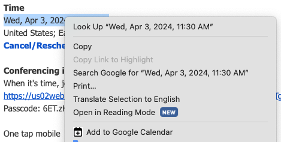

# add-to-gcal

An extension to allow the quick creation of events in google calendar by selecting date-like strings.

## Overview

Attempts to create a calendar event based on the date-like string that is highlighted.  This can be as straightforward as `1970-01-01 00:00:00` or as tricky as `Tuesday, 8:30 PM`.



## Implementation Notes

These are some of the formats that are supported:

* anything accepted by javascript's `Date()` [ref]()
* Tuesday, 8:00PM

## Parser format

Custom parsers can be added by creating a new file in `src/parsers`.  Ex:
```javascript
// src/parsers/fooParser.js
var foo = {
    name: 'An identifying string',
    group: (s: string): any[] | undefined => {
        /**
         * This function should return a truthy object if
         * the string that is selected is parseable to a date.
         * If the string is not parseable, return undefined.
         */
        return ['JAN 01 1970', 'JAN', '01', '1970'];
    },
    format: (groups: any[] | undefined): Date => {
        /**
         * This function should process the groups
         * returned from group() and return a Date
         */
        return new Date(groups[0]);
    }
};

var parsers = [ foo ];

export { parsers };
```

The parser should then be added to `src/parsers/index.js`:
```javascript
import { parsers as ebay } from './ebay'; // existing
import { parsers as foo } from './fooParser';

var parsers = [
    ...ebay, // existing
    ...fooParser
];

export { parsers }; // existing
```


## Running this extension

1. Clone this repository.
1. `npm install && npm run build`
1. Load the `extension` directory in Chrome as an [unpacked extension](https://developer.chrome.com/docs/extensions/mv3/getstarted/development-basics/#load-unpacked).
1. Right-click within the browser to view the context menu

## Contribute

* Found a bug?  Start a [discussion](https://github.com/nabraham/add-to-gcal/discussions).
* Want a new feature (like iCal or outlook)?  See above or better yet: fork and submit a merge request.
* Found this useful and want to show thanks?  [Buy me a coffee](https://buymeacoffee.com/nabraham)
