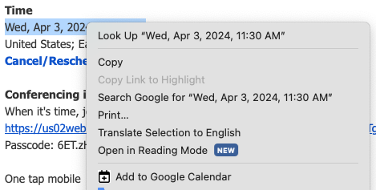

# add-to-gcal

An extension to allow the quick creation of events in google calendar by selecting date-like strings.

## Overview

Attempts to create a calendar event based on the date-like string that is highlighted. This can be as straightforward as `1970-01-01 00:00:00` or as tricky as `Tuesday, 8:30 PM`.



## Implementation Notes

These are some of the formats that are supported:

-   anything accepted by javascript's [Date()](https://developer.mozilla.org/en-US/docs/Web/JavaScript/Reference/Global_Objects/Date#several_ways_to_create_a_date_object)
-   Tuesday, 8:00PM

## Parser format

Custom parsers can be added by creating a new file in `src/background/parsers`. Ex:

```typescript
// src/parsers/foo.ts
var parsers: Parser[] = [{
    name: 'An identifying string',
    description: 'A description or example of expected strings it can process'
    group: (s: string): any[] | undefined => {
        /**
         * This function should return a truthy object if
         * the string that is selected is parseable to a date.
         * If the string is not parseable, return undefined.
         */
        return ['JAN 01 1970', 'JAN', '01', '1970'];
    },
    format: (groups: any[] | undefined): Date => {
        /**
         * This function should process the groups
         * returned from group() and return a Date
         */
        return new Date(groups[0]);
    }
}];

export { parsers };
```

The parser should then be added to `src/parsers/background/index.ts`:

```diff
+import { parsers as foo } from "./foo.js"

var parsers: Parser[] = [
+    ...foo,
    ...
];
```

## Running this extension

1. Clone this repository.
1. `npm install && npm run build`
1. Load the `dist` directory in Chrome as an [unpacked extension](https://developer.chrome.com/docs/extensions/mv3/getstarted/development-basics/#load-unpacked).
1. In a regular tab, select a string and right-click to view the context menu

## Recommended vscode extensions

-   [eslint](vscode:extension/dbaeumer.vscode-eslint)
-   [prettier](vscode:extension/esbenp.prettier-vscode)
-   [jest](vscode:extension/Orta.vscode-jest)

## Other commands

-   `npm run release` - create a release zip in `/release`
-   `npm run test` - run the tests in jest
-   `npm run lint` - run eslint
-   `npm run prettier` - run prettier
-   `npm run test-all` - run test, lint, and prettier

## Contribute

-   Found a bug? Start a [discussion](https://github.com/nabraham/add-to-gcal/discussions).
-   Want a new feature (like iCal or outlook)? See above or better yet: fork and submit a merge request.
-   Found this useful and want to show thanks? [Buy me a coffee](https://buymeacoffee.com/nabraham)
