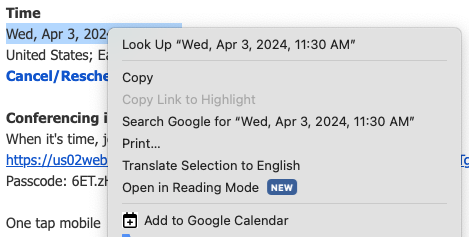

# add-to-gcal

An extension to allow the quick creation of events in google calendar by selecting date-like strings and right clicking.

## Overview

Attempts to create a calendar event based on the date-like string that is highlighted.  This can be as straightforward as `1970-01-01 00:00:00` or as tricky as `Tuesday, 8:30 PM`.

## Contribute

* Please visit the [repository on github](https://github.com/nabraham/add-to-gcal) if you wish to contribute code changes or discuss issues.
* Found this useful and want to show thanks?  [Buy me a coffee](https://buymeacoffee.com/nabraham)